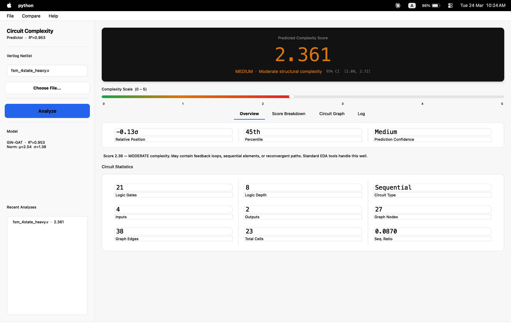
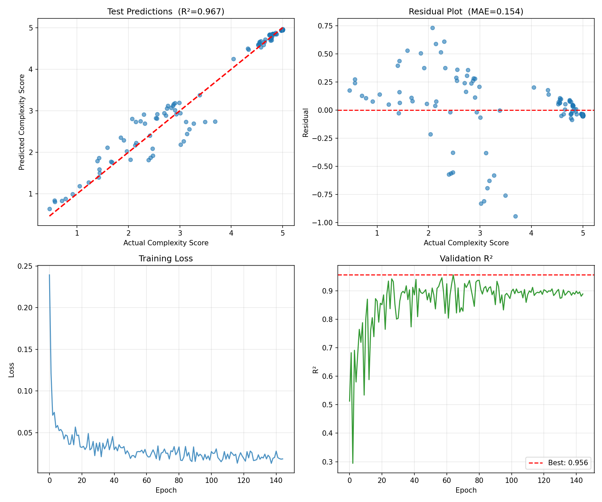

# Circuit Complexity Predictor

A Graph Neural Network (GNN) system that predicts the structural complexity of digital circuits from gate-level Verilog netlists. Built as a diploma thesis at the National Polytechnic University of Armenia, 2026.



---

## The Problem

When designing a digital circuit (a CPU, a memory controller, an encryption core), engineers need to understand how complex it is — how deep the logic paths are, how many feedback loops exist, how difficult it will be to synthesize and optimize. Traditionally this requires running expensive EDA tools like Yosys or Synopsys.

This project trains a GNN to predict that complexity score directly from the circuit's netlist — skipping the expensive toolchain entirely. The circuit is modeled as a directed graph where nodes are logic gates and edges are connections between them, and the model learns structural patterns that correlate with complexity.

---

## How It Works

```
Gate-level Verilog netlist (.v)
        │
        ▼
  Netlist Parser         identifies gates, connections, port types
        │
        ▼
  NetworkX Graph         structural analysis via BFS, DFS, Tarjan
                         computes: depth, feedback ratio, SCC size,
                         sequential ratio, XOR density, entropy
        │
        ▼
  PyG Graph Builder      builds PyTorch Geometric Data object
                         24-dim node features + 10-dim global features
                         → 34-dim combined input per node
        │
        ▼
  GIN + GAT Model        34→48 projection → 2 GIN layers → 2 GAT layers
                         (4 attention heads) → triple pooling → MLP
        │
        ▼
  Complexity Score       0.0 (simple) → 5.0 (highly complex)
```

---

## Model Architecture

The core model (`ImprovedGIN_GAT`) uses a single-path design where global circuit-level features are broadcast to all nodes to combine local graph structure with global circuit-level features:

- **Input** — 24-dim node features concatenated with 10-dim global features → 34-dim per node
- **Projection** — linear layer (34→48)
- **GIN layers** — 2 layers with residual connections, sum aggregation
- **GAT layers** — 2 layers with 4 attention heads
- **Pooling** — triple pooling (sum + mean + max)
- **Regression head** — fusion MLP → complexity score

**Training details:**
- Loss: HuberLoss (robust to outliers)
- Optimizer: AdamW with CosineAnnealingWarmRestarts
- Regularization: input Gaussian noise, dropout, gradient clipping
- Uncertainty: Monte Carlo dropout at inference time

---

## Results

Evaluated on a held-out test set of 64 circuits:

| Metric | Value |
|---|---|
| R² | 0.967 |
| MAE | 0.154 |
| RMSE | 0.2518 |
| Pearson r | 0.9834 |
| Best validation R² | 0.956 |



---

## Installation

```bash
git clone https://github.com/anngalstyan/Circuit-Complexity-GNN.git
cd Circuit-Complexity-GNN
pip install -r requirements.txt
```

**Requirements:** Python 3.11+, PyTorch 2.0+, PyTorch Geometric, PyQt5

---

## Usage

**GUI — load a netlist and get predictions interactively**
```bash
python src/circuit_complexity_gui.py
```

**Predict from the command line**
```bash
python scripts/evaluate_model.py \
    --model models/best_complexity_model.pt \
    --data-dir data/processed_complexity \
    --uncertainty
```

**Train from scratch**
```bash
# Step 1: preprocess netlists into graph objects
python src/preprocess_dataset.py \
    --dataset data/augmented_filtered \
    --output  data/processed_complexity

# Step 2: train
python src/circuit_complexity_model_v2.py \
    --data-dir data/processed_complexity \
    --output   models/best_complexity_model_v2.pt
# Step 3: deploy checkpoint
cp best_complexity_model_v2.pt models/best_complexity_model.pt
```

---

## Dataset

The training data is not included in this repository due to size (~6.4 GB). The dataset consists of 812 gate-level Verilog netlists spanning common circuit families (DMA controllers, RISC processors, AES cores, DSP blocks, multipliers, FSMs) each augmented with structural variants.

`data/processed_complexity/metadata.json` and `splits.json` document the dataset structure and train/val/test split.

To use your own circuits: place gate-level Verilog `.v` files in `data/raw/`, then run the preprocessing script above.

---

## Project Structure

```
src/
  circuit_complexity_model_v2.py     GIN+GAT model and training pipeline
  circuit_complexity_gui.py       PyQt5 GUI application
  circuit_graph_widget.py         Circuit graph visualization widget
  preprocess_dataset.py           Verilog → PyTorch Geometric pipeline
  netlist/
    parser.py                     Verilog netlist tokenizer and parser
    converter.py                  Graph construction from parsed netlist
    metrics.py                    Structural complexity metrics
scripts/
  evaluate_model.py               Full evaluation with uncertainty estimation
  create_stratified_splits.py     Train/val/test splitting (group-aware)
  smart_augmenter.py              Circuit augmentation
  generate_circuit_families.py    Synthetic circuit generation
tests/
  test_model.py                   Model architecture and checkpoint tests
  test_netlist_parser.py          Netlist parser unit tests
models/
  best_complexity_model.pt Primary trained checkpoint (V2)
plots/
  dataset_overview.png              Score distribution, circuit sizes, train/val/test split
  yosys_speed_comparison.png        GNN vs Yosys synthesis time by circuit size
  yosys_validation.png              Parser vs Yosys gate count, depth, and model vs formula correlation

```

---

## What I'd Improve

- The complexity score is a heuristic proxy — ground truth labels from actual synthesis timing reports would make the target more meaningful
- The Verilog parser handles a fixed cell library; a more general parser would support arbitrary technology libraries
- Adding an explainability layer (GNN attribution / attention visualization) to show which gates drive the complexity score
- Packaging as a proper installable Python library with a CLI entry point

---

## Academic Context

This project was developed as a diploma thesis exploring the application of graph neural networks to electronic design automation (EDA). The central question: can structural properties visible in a gate-level netlist predict synthesis complexity well enough to replace expensive tool runs in early-stage design exploration?

---

## License

MIT
